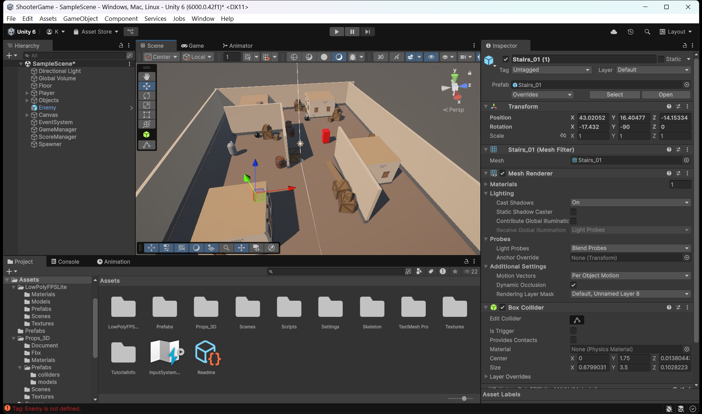

# Shooter Game (Unity)

## Project Description

This project is a **simple 3D Shooter Game developed in Unity** for the course **Introduction to Game Development**.

The player moves around the environment, shoots enemies, and earns points for each enemy destroyed. Enemies spawn randomly across the map, and the game tracks the player's score during gameplay. 

---

# Game Structure

## Scene

The game contains a **3D environment scene** with simple objects used as obstacles and environment decorations.

Environment elements may include:

* Buildings
* Planks
* Boxes

These objects create the game space where the player and enemies interact. 



---

# Player

The player is created using a **Capsule 3D object**.

Structure of the player object:

Player
├── Camera
└── FirePoint

Components attached to Player:

* **Character Controller**
* **PlayerMovement Script**

### PlayerMovement.cs

This script controls:

* player movement
* camera direction
* navigation through the environment

The **Character Controller component** allows smooth movement and collision handling. 

---

# Shooting System

The game includes a simple shooting mechanic.

### Bullet

A bullet is created using a **Sphere object** with the following settings:

* Scale: **0.2**
* Rigidbody component
* **Use Gravity disabled**

The bullet object is converted into a **Prefab** to allow repeated spawning during gameplay. 

### FirePoint

Inside the player object, an empty object called **FirePoint** is created.
This object defines the position where bullets spawn when shooting.

### Gun.cs

The **Gun script** handles shooting mechanics:

Main functionality:

* detects left mouse button click
* spawns a bullet
* launches it forward from FirePoint

The script requires two references in the Inspector:

* Bullet Prefab
* FirePoint Transform

---

# Enemies

Enemies are created using a **Cube object**.

Enemy components:

* BoxCollider
* Rigidbody

A custom **Enemy tag** is assigned to all enemies.

### Enemy.cs

This script detects collisions between bullets and enemies.

When a bullet hits an enemy:

* the enemy is destroyed
* the bullet is destroyed
* the player's score increases

Enemies are also converted into **Prefabs** for spawning. 

---

# Score System

The game tracks the player's score.

### UI Setup

A **Canvas** is created with a **TextMeshPro text element**:

Object name:

```
ScoreText
```

This text displays the current score during the game.

### ScoreManager.cs

This script:

* tracks points
* updates the score UI
* increases score when enemies are destroyed

The script is attached to an empty object called **ScoreManager**. 

---

# Game Over System

The game includes a **Game Over screen**.

### UI Elements

A panel is created in the Canvas:

```
GameOverPanel
```

The panel is **disabled by default** in the Inspector.

Inside the panel:

* Restart Button

### Restart Button

The button calls:

```
GameManager.Restart()
```

This function restarts the game and resets the gameplay state. 

---

# Enemy Spawner

Enemies appear dynamically using a spawning system.

### EnemySpawner

An empty GameObject named:

```
EnemySpawner
```

is added to the scene.

### EnemySpawner.cs

This script is responsible for:

* spawning enemies randomly across the map
* controlling the number of enemies in the scene
* instantiating enemy prefabs

In the Inspector you must assign:

* Enemy Prefab
* Number of enemies to spawn

---

# Gameplay Flow

1. Player enters the environment.
2. Enemies spawn randomly in the scene.
3. Player moves using keyboard controls.
4. Player shoots enemies using the left mouse button.
5. Destroying enemies increases the score.
6. The game tracks the player's progress and displays the result.

